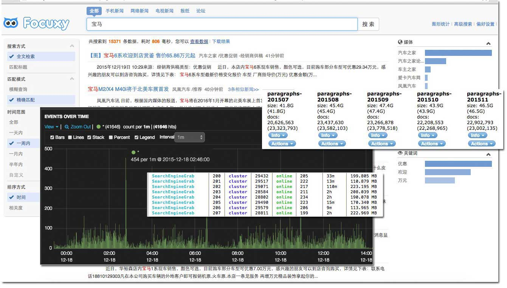
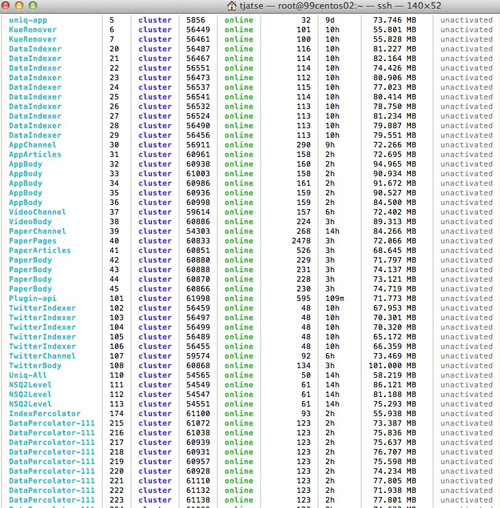

read-art [](http://badge.fury.io/js/read-art) [](https://travis-ci.org/Tjatse/node-readability)
=========
[](https://nodei.co/npm/read-art/)

1. Readability reference to Arc90's.
2. Scrape article from any page (automatically).
3. Make any web page readable, no matter Chinese or English.

> *快速抓取网页文章标题和内容，适合node.js爬虫使用，服务于ElasticSearch。*

## Features
- Faster Than Any Readability Module
- High Performance - Less memory
- Automatic Read Title & Content
- Follow Redirects
- Automatic Decoding Content Encodings(Avoid Messy Codes, Especially Chinese)
- Gzip/Deflate Support
- Proxy Support
- Generate User-Agent

## Performance
In my case, the indexed data is about **400 thousand per day**, **10 million per month**, and the maximize indexing speed is **35/second**, the memory cost are limited **under 100 megabytes**.

**Pictures don't lie:**







Maybe you wanna known:
- All the spiders are managed by [PM2](https://github.com/Unitech/PM2) (I am currently working on that with friends, very welcome to use the amazing tool).
- Loose coupling between Spiders, Indexers and Data, they're queued by NSQ.

## Pure Example With High Availability
[spider2](https://github.com/Tjatse/spider2)

## Installation
```javascript
npm install read-art
```

## Usage
```javascript
read(html/uri [, options], callback)
```

It supports the definitions such as:

  * **html/uri** Html or Uri string.
  * **options** An optional options object, including:
    - **output** The data type of article content, including: `html`, `text` or `json`. see more from [Output](#output)
    - **killBreaks** A value indicating whether kill breaks, blanks, tab symbols(\r\t\n) into one `<br />` or not, `true` by default.
    - **options from [cheerio](https://github.com/cheeriojs/cheerio)**
    - **options from [req-fast](https://github.com/Tjatse/req-fast)**
  * **callback** The callback to run - `callback(error, article, options)`

> See test or examples folder for a complete example

### Simple Examples
```javascript
var read = require('read-art');
// read from google:
read('http://google.com', function(err, art, options){
    if(err){
      throw err;
    }
    var title = art.title,      // title of article
        content = art.content,  // content of article
        html = art.html;        // whole original innerHTML
});
// or:
read({
    uri: 'http://google.com',
    charset: 'utf8'
  }, function(err, art, options){

});
// what about html?
read('<title>node-art</title><body><div><p>hello, read-art!</p></div></body>', function(err, art, options){

});
// of course could be
read({
    uri: '<title>node-art</title><body><div><p>hello, read-art!</p></div></body>'
  }, function(err, art, options){

});
```
**CAUTION:** Title must be wrapped in a `<title>` tag and content must be wrapped in a `<body>` tag.

## Output
You can wrap the content of article with different types, the `output` option could be:
- **String**
  One of `text`, `html` and `json`, `html` by default.
- **Object**
  Key-value pairs including:
  - **type**
    One of `text`, `html` and `json`.
  - **stripSpaces**
    A value indicates whether strip the tab symbols (\r\n\t) or not, `false` by default.

### text
Returns the inner text, e.g.:
```javascript
read('http://example.com', {
  output: 'text'
}, function(err, art){
  // art.content will be formatted as TEXT
});
// or
read('http://example.com', {
  output: {
    type: 'text',
    stripSpaces: true
  }
}, function(err, art){
  // art.content will be formatted as TEXT
});
```

### html
Returns the inner HTML, e.g.:
```javascript
read('http://example.com', {
  output: 'html'
}, function(err, art){
  // art.content will be formatted as HTML
});
// or
read('http://example.com', {
  output: {
    type: 'html',
    stripSpaces: true
  }
}, function(err, art){
  // art.content will be formatted as HTML
});
```

**Notes** Videos could be scraped now, the domains currently are supported: *youtube|vimeo|youku|tudou|56|letv|iqiyi|sohu|sina|163*.

### json
Returns the restful result, e.g.:
```javascript
read('http://example.com', {
  output: 'json'
}, function(err, art){
  // art.content will be formatted as JSON
});
// or
read('http://example.com', {
  output: {
    type: 'json',
    stripSpaces: true
  }
}, function(err, art){
  // art.content will be formatted as Array
});
```

The art.content will be an Array such as:
```json
[
  { "type": "img", "value": "http://example.com/jpg/site1/20140519/00188b1996f214e3a25417.jpg" },
  { "type": "text", "value": "TEXT goes here..." }
]
```

Util now there are only two types - *img* and *text*, the `src` of `img` element is absolute even if the original is a relative one.

**Notes** The video sources of the sites are quite different, it's hard to fit all in a common way, I haven't find a good way to solve that, PRs are in demand.


## You Should Known
### Pass the charset manually to refrain from the crazy messy codes
```javascript
read('http://game.163.com/14/0506/10/9RI8M9AO00314SDA.html', {
  charset: 'gbk'
}, function(err, art){
  // ...
});
```

### Generate agent to simulate browsers
```javascript
read('http://example.com', {
  agent: true // true as default
}, function(err, art){
  // ...
});
```

### Use proxy to avoid being blocked.
```javascript
read('http://example.com', {
  proxy: {
    host: 'http://myproxy.com/',
    port: 8081,
    proxyAuth: 'user:password'
  }
}, function(err, art){
  // ...
});
```

## Test
```
npm test
```

## Other Library
### [luin/node-readability](https://github.com/luin/node-readability)
luin/node-readability is an old Readability that be transformed from **Arc90**, easy to use, but the problem is - TOO SLOW. It was based on `jsdom`, so, the HTML must be written in strict mode, which means you can not make any mistake, e.g.:

```html
<P>Paragraphs</p>
<p>My book name is <read-art></p>
<div><p>Hey, dude!</div>
```

All above will cause `hiberarchy errors`, more seriously, `jsdom` is a memory killer.

### [bndr/node-read](https://github.com/bndr/node-read)
I've contributed on this for a while, but it's hard to communicate with Vadim(we are in a different timezone), and we have very different ideas. So I decided to write it on my own.

## TODO
- [ ] get published time
- [ ] get author
- [ ] get source
- [ ] pagination

## License
Copyright 2014 Tjatse

Licensed under the Apache License, Version 2.0 (the "License");
you may not use this file except in compliance with the License.
You may obtain a copy of the License at

    http://www.apache.org/licenses/LICENSE-2.0

Unless required by applicable law or agreed to in writing, software
distributed under the License is distributed on an "AS IS" BASIS,
WITHOUT WARRANTIES OR CONDITIONS OF ANY KIND, either express or implied.
See the License for the specific language governing permissions and
limitations under the License.


